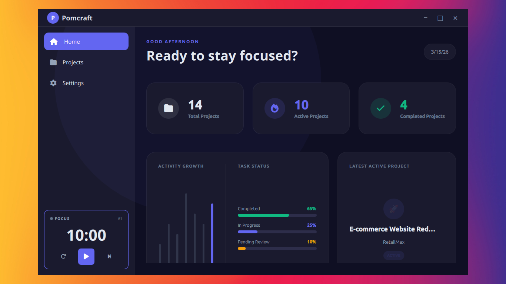
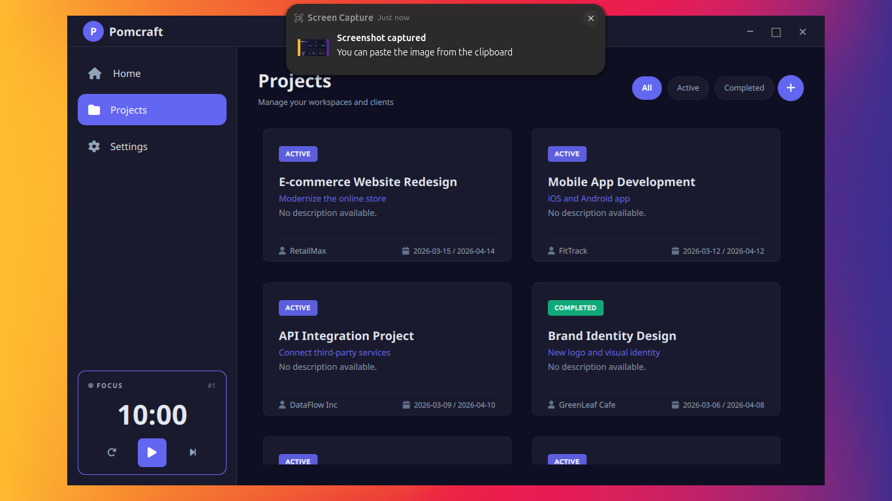
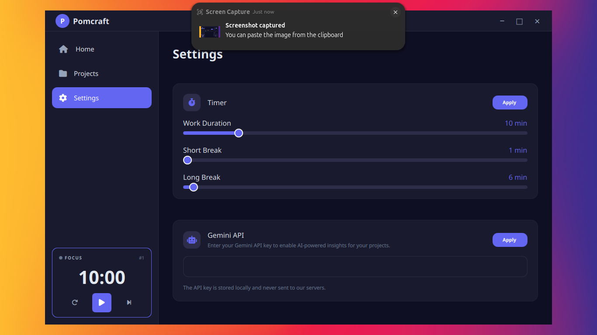

# Pomcraft

Craft your focus.

Pomcraft is an open-source, developer-focused Pomodoro timer that integrates Markdown tasks and AI-powered task generation. It is designed for developers who work from README.md files and want to convert plans into execution without friction.

---

## Features

- **Pomodoro Timer** with customizable work and break sessions
- **Desktop Notifications** with sound effects when sessions complete
- **Project Management** with client tracking and status management
- **Markdown Workspace** for project details and task planning
- **Task Management** with Pomodoro session linking
- **Activity Tracking** and productivity statistics
- **Modern Desktop Interface** built with PySide6 and QML
- **AI-Powered Task Generation** *(Coming Soon)* - Generate tasks from Markdown using Gemini
- **Fully Open Source** under MIT License

---

## Screenshots


*Dashboard showing project statistics and recent activity*


*Project management with filtering by status*


*Pomodoro timer with session tracking*


*Customizable timer durations and notification preferences*

---

## Installation

### Requirements

- Python 3.13 or newer
- PySide6 with Multimedia support

### Install dependencies

```bash
pip install -r requirements.txt
```

### Run

```bash
python main.py
```

---

## Project Structure

```
pomcraft/
├── main.py                    # Application entry point
├── src/
│   ├── __init__.py
│   ├── backend.py             # Backend classes exports
│   ├── timer.py               # Pomodoro timer logic
│   ├── tasks.py               # Task management
│   ├── settings.py            # Settings persistence
│   ├── projects.py            # Project management
│   ├── database.py            # Database models
│   ├── highlighter.py         # Markdown syntax highlighting
│   └── markdown_renderer.py   # Markdown rendering
├── resources/
│   ├── qml/                   # QML UI files
│   │   ├── Main.qml
│   │   ├── pages/
│   │   └── components/
│   ├── sounds/                # Notification sounds
│   │   └── notification.wav
│   ├── fonts/                 # Font files
│   └── screenshots/           # README screenshots
├── tests/
├── requirements.txt
├── pyproject.toml
└── README.md
```

---

## Development

### Setup Development Environment

```bash
# Clone the repository
git clone https://github.com/yourusername/pomcraft.git
cd pomcraft

# Create virtual environment
python3 -m venv .venv
source .venv/bin/activate  # Linux/macOS
# or
.venv\Scripts\activate      # Windows

# Install dependencies
pip install -r requirements.txt
```

### Running Tests

```bash
pytest
```

### Building Executable

```bash
pyinstaller --name="Pomcraft" --windowed main.py
```

### Code Style

We use Ruff for linting and formatting:

```bash
ruff check .
ruff format .
```

---

## Usage

### Getting Started

1. Launch Pomcraft: `python main.py`
2. Navigate to **Projects** to create your first project
3. Set your **Timer** preferences in Settings
4. Start a **Pomodoro session** from the sidebar timer
5. Track your **productivity** on the Home dashboard

### Timer Controls

- **Play/Pause**: Start or pause the current session
- **Reset**: Reset timer to initial duration
- **Skip**: Skip to next session (work → break → work)

### Project Management

- Create projects with title, headline, client name, and deadlines
- Track project status: Active or Completed
- Use Markdown workspace for detailed project notes
- Filter projects by status (All, Active, Completed)

### Settings

Settings are stored locally in `~/.pomcraft/settings.json`:

- **Work Duration**: 1-60 minutes (default: 25)
- **Short Break**: 1-30 minutes (default: 5)
- **Long Break**: 5-60 minutes (default: 15)
- **Sound Effects**: Enable/disable notification sounds
- **Gemini API Key**: For AI task generation (optional)

---

## Gemini Integration

Add your Gemini API key in **Settings** → **Gemini API**.

Pomcraft will use it to generate tasks from Markdown files.

The API key is stored locally in `~/.pomcraft/settings.json`.

---

## Vision

Pomcraft is built on a simple idea:

**Markdown is a plan.**
**Pomodoro is execution.**
**AI assists the transition between both.**

---

## Built with

- **Python 3.13+** - Core application logic
- **PySide6** - Qt bindings for Python
- **QML** - Declarative UI framework
- **PyInstaller** - Application packaging
- **SQLAlchemy** - Database ORM
- **Gemini API** - AI task generation *(Coming Soon)*

---

## Contributing

Contributions are welcome!

You can contribute by:
- Reporting issues
- Suggesting features
- Improving the codebase
- Adding documentation
- Sharing screenshots and feedback

Please read our [Contributing Guide](CONTRIBUTING.md) for details.

---

## License

MIT License - see [LICENSE](LICENSE) file for details.

---

## Philosophy

> Stop planning.  
> Start crafting.

**Pomcraft**
